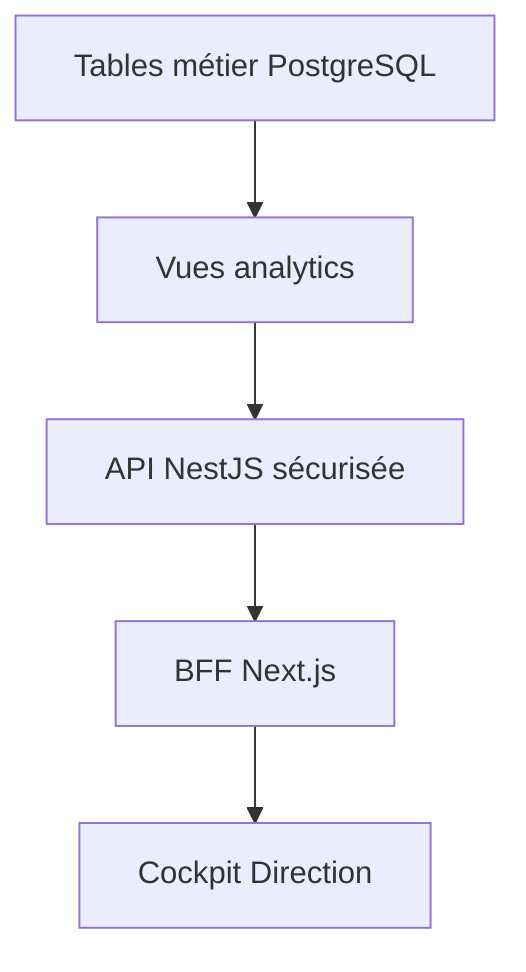

# Étape 11 — Data Platform et cockpit Direction

## Décision d’architecture MVP

Le cockpit Direction fonctionne entièrement dans le socle Docker autonome. Il ne dépend d’aucun service Azure. PostgreSQL fournit à la fois le système transactionnel et un schéma de lecture analytique isolé nommé `analytics`.

Cette séparation maintient un contrat stable entre le métier et le cockpit. Une plateforme analytique dédiée pourra remplacer les vues PostgreSQL à l’échelle nationale sans modifier l’interface Direction ni les définitions des indicateurs.

## Chaîne de données



Le jeu local `database/seeds/002_analytics_demo.sql` fournit plusieurs régions, secteurs, programmes, décisions, décaissements, remboursements et suivis d’impact. Il ne contient aucune donnée réelle.

## Modèles de lecture

| Vue | Grain | Usage |
|---|---|---|
| `analytics.vw_dossier_portfolio` | Un dossier | Pipeline, montants demandés/approuvés, région, secteur, programme, dernier score et dernière décision |
| `analytics.vw_financing_performance` | Un financement | Montants accordés, décaissés, dus, remboursés et impayés |
| `analytics.vw_latest_impact` | Dernier suivi par PME | Emplois créés/maintenus, chiffre d’affaires et couverture du suivi |

## Définitions des KPI

| Indicateur | Définition MVP |
|---|---|
| PME dans le portefeuille | Nombre distinct de PME ayant au moins un dossier dans le périmètre filtré |
| Dossiers actifs | Dossiers `SOUMIS`, `EN_INSTRUCTION`, `COMPLEMENT_REQUIS` ou `PRET_COMITE` |
| Montant demandé | Somme des demandes hors brouillons |
| Montant approuvé | Somme de la dernière décision approuvée par dossier |
| Montant décaissé | Somme des décaissements au statut `EFFECTUE` |
| Taux de remboursement | Montants remboursés divisés par montants arrivés à échéance, plafonné à 100 % |
| Impayés | Montants arrivés à échéance moins remboursements, avec plancher à zéro |
| Emplois créés | Somme du dernier snapshot d’impact disponible pour chaque PME |
| Taux de dirigeantes | PME dont le dirigeant principal renseigné est une femme, divisées par les PME avec genre renseigné |

## Sécurité et filtres

L’endpoint `GET /api/v1/analytics/dashboard` exige :

- un JWT valide ;
- le rôle `DIRECTION_FODIP`, `ANALYSTE` ou `SUPER_ADMIN` ;
- la permission `dashboard.read`.

Les filtres `regionId` et `programmeId` sont des UUID validés par NestJS et sont appliqués de façon uniforme aux dossiers, financements et suivis d’impact. Le token reste dans un cookie HttpOnly côté navigateur et passe par le BFF Next.js.

## Fraîcheur et qualité

Chaque réponse indique :

- la date de génération de la réponse ;
- la dernière modification observée dans les sources principales ;
- le nom de la source analytique.

Le smoke test Docker vérifie la connexion Direction, l’accès RBAC, la présence d’au moins quatre PME et quatre régions, les décaissements consolidés et le contrat de fraîcheur.

## Démarrage local

```bash
docker compose up --build
```

Puis ouvrir `http://localhost:3000/direction/connexion` avec le compte de démonstration indiqué dans le README.
