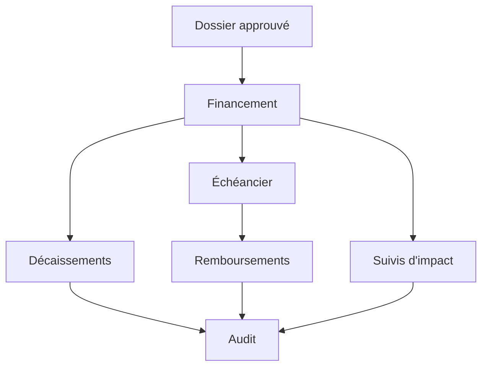

# Étape 12 — Cycle financier opérationnel

## Objectif

Cette étape transforme une décision du Comité en opérations financières réellement pilotables dans le socle Docker autonome.

Le workflow couvert est :

## Règles métier

### Création du financement

- le dossier doit être au statut `APPROUVE` ;
- la dernière décision doit être `APPROUVE` ;
- le montant, le taux et la durée viennent exclusivement de la décision du Comité ;
- un dossier ne peut produire qu’un seul financement ;
- l’échéancier est généré automatiquement avec remboursement linéaire du capital et intérêts sur le capital restant ;
- la somme du capital des échéances correspond exactement au montant accordé.

### Décaissements

- une tranche est d’abord `PREVU` ;
- la somme des tranches non annulées ne peut dépasser le montant accordé ;
- la confirmation exige une date effective et une référence bancaire ;
- les contrôles de plafond sont exécutés sous verrou transactionnel pour empêcher un dépassement concurrent.

### Remboursements

- le paiement doit référencer une échéance du financement ;
- le cumul ne peut dépasser le montant total de l’échéance ;
- l’échéance passe à `PARTIELLEMENT_PAYEE` ou `PAYEE` ;
- le solde est contrôlé sous verrou transactionnel.

### Impact

- un snapshot est unique par financement et période ;
- une nouvelle saisie sur la même période met à jour le snapshot ;
- les indicateurs monétaires et d’emploi ne peuvent être négatifs ;
- les emplois femmes + hommes ne peuvent dépasser l’effectif total renseigné.

## API

| Méthode | Route | Permission |
|---|---|---|
| `GET` | `/api/v1/financings` | `financing.read` |
| `GET` | `/api/v1/financings/eligible-applications` | `financing.manage` |
| `POST` | `/api/v1/financings/applications/:id` | `financing.manage` |
| `GET` | `/api/v1/financings/:id` | `financing.read` |
| `POST` | `/api/v1/financings/:id/disbursements` | `disbursement.manage` |
| `POST` | `/api/v1/financings/:id/disbursements/:disbursementId/execute` | `disbursement.manage` |
| `POST` | `/api/v1/financings/:id/repayments` | `repayment.manage` |
| `POST` | `/api/v1/financings/:id/impact` | `impact.manage` |

Les opérations d’écriture sont réservées à `DIRECTION_FODIP` et `SUPER_ADMIN`. Le profil `ANALYSTE` conserve un accès en lecture selon ses permissions.

## Interface Direction

- `/direction/financements` : portefeuille, décisions éligibles et création du financement ;
- `/direction/financements/:id` : contrat, décaissements, échéancier, remboursements, impact et audit.
- `/direction/rapprochements` : mouvements des relevés bancaires, file de contrôle et rapprochements audités.

Le navigateur ne reçoit jamais le JWT. Toutes les requêtes passent par les routes serveur Next.js et le cookie HttpOnly existant.

## Audit

Les actions suivantes produisent une trace :

- `CREATE_FINANCING` ;
- `PLAN_DISBURSEMENT` ;
- `EXECUTE_DISBURSEMENT` ;
- `CREATE_REPAYMENT` ;
- `CREATE_IMPACT` ;
- `UPDATE_IMPACT`.

Le journal est consultable dans la fiche financement, mais aucune route de modification ou de suppression n’est exposée.

## Validation Docker

Le smoke test réalise réellement : décision du Comité, création du financement et de 36 échéances, planification et confirmation d’une tranche, paiement partiel, saisie d’impact, contrôle de l’audit et réconciliation du cockpit Direction.
